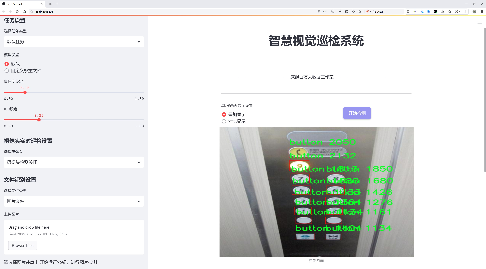
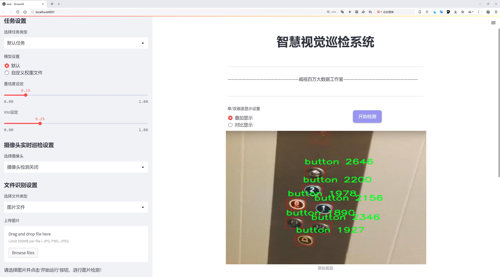

# 电梯按钮检测检测系统源码分享
 # [一条龙教学YOLOV8标注好的数据集一键训练_70+全套改进创新点发刊_Web前端展示]

### 1.研究背景与意义

项目参考[AAAI Association for the Advancement of Artificial Intelligence](https://gitee.com/qunmasj/projects)

项目来源[AACV Association for the Advancement of Computer Vision](https://github.com/qunshansj/good)

研究背景与意义

随着城市化进程的加快，电梯作为现代建筑中不可或缺的垂直交通工具，其安全性和便利性愈发受到重视。电梯按钮作为用户与电梯系统之间的直接交互界面，其设计和功能直接影响到用户的使用体验和安全性。然而，传统的电梯按钮检测方法多依赖人工检查，效率低且容易出现遗漏，尤其是在大型建筑或公共场所，电梯按钮的种类繁多、数量庞大，人工检测的工作量巨大且容易出错。因此，基于计算机视觉的自动化检测系统的研究与开发显得尤为重要。

在此背景下，基于改进YOLOv8的电梯按钮检测系统应运而生。YOLO（You Only Look Once）系列模型因其高效的实时目标检测能力而广泛应用于各类视觉识别任务。YOLOv8作为该系列的最新版本，具备更强的特征提取能力和更快的推理速度，能够有效应对复杂环境下的目标检测问题。通过对YOLOv8进行改进，结合电梯按钮的特定特征和实际应用需求，可以大幅提升电梯按钮的检测精度和速度，从而实现对电梯按钮的自动化识别与监控。

本研究所使用的数据集包含2002张图像，涵盖363个类别的电梯按钮。这一丰富的数据集不仅为模型的训练提供了充分的样本支持，也为电梯按钮的多样性和复杂性提供了真实的反映。数据集中包含的按钮种类繁多，包括数字、字母、符号以及各种功能提示，如“开门”、“关门”、“紧急呼叫”等。这些类别的多样性为模型的学习提供了挑战，同时也使得研究成果具有更广泛的应用前景。

通过构建基于改进YOLOv8的电梯按钮检测系统，研究不仅可以提升电梯按钮的识别效率，还能为电梯的智能化管理提供技术支持。该系统能够实时监测电梯按钮的状态，及时发现故障或异常情况，从而提高电梯的安全性和可靠性。此外，系统的推广应用还将推动电梯行业向智能化、自动化方向发展，提升用户的乘梯体验。

总之，基于改进YOLOv8的电梯按钮检测系统的研究具有重要的理论价值和实际意义。它不仅为电梯按钮的自动化检测提供了新的解决方案，也为计算机视觉技术在智能交通、建筑管理等领域的应用提供了借鉴。通过这一研究，期望能够推动电梯行业的技术进步，提高电梯的安全性和用户体验，为现代城市的智能化建设贡献力量。

### 2.图片演示






##### 注意：由于此博客编辑较早，上面“2.图片演示”和“3.视频演示”展示的系统图片或者视频可能为老版本，新版本在老版本的基础上升级如下：（实际效果以升级的新版本为准）

  （1）适配了YOLOV8的“目标检测”模型和“实例分割”模型，通过加载相应的权重（.pt）文件即可自适应加载模型。

  （2）支持“图片识别”、“视频识别”、“摄像头实时识别”三种识别模式。

  （3）支持“图片识别”、“视频识别”、“摄像头实时识别”三种识别结果保存导出，解决手动导出（容易卡顿出现爆内存）存在的问题，识别完自动保存结果并导出到tempDir中。

  （4）支持Web前端系统中的标题、背景图等自定义修改，后面提供修改教程。

  另外本项目提供训练的数据集和训练教程,暂不提供权重文件（best.pt）,需要您按照教程进行训练后实现图片演示和Web前端界面演示的效果。

### 3.视频演示

[3.1 视频演示](https://www.bilibili.com/video/BV1tWsMedEH4/?vd_source=ff015de2d29cbe2a9cdbfa7064407a08)

### 4.数据集信息展示

数据集信息展示

本数据集专注于电梯按钮的检测，旨在为改进YOLOv8模型提供丰富的训练数据。该数据集包含2002张图像，涵盖了363个类别，展示了电梯按钮的多样性和复杂性。电梯按钮作为现代建筑中不可或缺的组成部分，其设计和功能各异，因此对其进行有效的检测和识别显得尤为重要。

在这个数据集中，类别的划分非常细致，涵盖了从数字按钮到功能性标识的各种类型。具体来说，类别列表中包含了从“0”到“9”的数字按钮，以及多种字母和符号组合，如“A”、“B”、“C”等，甚至包括“alarm”、“call”、“open”等功能性文本。这种多样化的类别设置不仅反映了电梯按钮的实际应用场景，也为模型的训练提供了丰富的标注信息，使得模型能够更好地适应不同环境下的电梯按钮识别任务。

数据集中所包含的图像质量和多样性也为模型的训练提供了良好的基础。图像的来源和拍摄角度各异，确保了模型在面对真实世界中的电梯按钮时，能够具备较强的泛化能力。通过对不同光照、角度和背景的图像进行训练，YOLOv8模型将能够更准确地识别电梯按钮，无论是在繁忙的商业大楼还是在住宅区的电梯中。

此外，数据集的设计也考虑到了实际应用中的各种挑战。例如，电梯按钮可能会因使用频繁而磨损，导致标识模糊；或者在复杂的环境中，按钮可能会被其他物体遮挡。数据集中包含的类别如“blur”、“text”、“unknown”等，正是为了帮助模型学习如何处理这些潜在的干扰因素，从而提高检测的准确性和鲁棒性。

值得一提的是，该数据集在使用时遵循CC BY 4.0许可证，允许用户在遵循相应条款的前提下进行修改和再分发。这种开放的共享方式促进了研究人员和开发者之间的合作与交流，使得电梯按钮检测技术能够更快地发展和完善。

综上所述，这个电梯按钮检测数据集不仅提供了丰富的图像和类别信息，还为YOLOv8模型的训练奠定了坚实的基础。通过对该数据集的有效利用，研究人员和开发者可以显著提升电梯按钮的检测能力，为智能建筑和自动化系统的进一步发展提供支持。随着电梯技术的不断进步，能够准确识别和响应电梯按钮的系统将为用户提供更为便捷和安全的乘梯体验。


### 5.全套项目环境部署视频教程（零基础手把手教学）

[5.1 环境部署教程链接（零基础手把手教学）](https://www.ixigua.com/7404473917358506534?logTag=c807d0cbc21c0ef59de5)


[5.2 安装Python虚拟环境创建和依赖库安装视频教程链接（零基础手把手教学）](https://www.ixigua.com/7404474678003106304?logTag=1f1041108cd1f708b01a)

### 6.手把手YOLOV8训练视频教程（零基础小白有手就能学会）

[6.1 环境部署教程链接（零基础手把手教学）](https://www.ixigua.com/7404477157818401292?logTag=d31a2dfd1983c9668658)

### 7.70+种全套YOLOV8创新点代码加载调参视频教程（一键加载写好的改进模型的配置文件）

[7.1 环境部署教程链接（零基础手把手教学）](https://www.ixigua.com/7404478314661806627?logTag=29066f8288e3f4eea3a4)

### 8.70+种全套YOLOV8创新点原理讲解（非科班也可以轻松写刊发刊，V10版本正在科研待更新）

由于篇幅限制，每个创新点的具体原理讲解就不一一展开，具体见下列网址中的创新点对应子项目的技术原理博客网址【Blog】：


[8.1 70+种全套YOLOV8创新点原理讲解链接](https://gitee.com/qunmasj/good)

### 9.系统功能展示（检测对象为举例，实际内容以本项目数据集为准）

图9.1.系统支持检测结果表格显示

  图9.2.系统支持置信度和IOU阈值手动调节

  图9.3.系统支持自定义加载权重文件best.pt(需要你通过步骤5中训练获得)

  图9.4.系统支持摄像头实时识别

  图9.5.系统支持图片识别

  图9.6.系统支持视频识别

  图9.7.系统支持识别结果文件自动保存

  图9.8.系统支持Excel导出检测结果数据


### 10.原始YOLOV8算法原理

原始YOLOv8算法原理

YOLOv8作为目标检测领域的最新进展，承载着YOLO系列算法的优良传统，并在此基础上进行了多项创新与优化。其设计理念旨在实现高效、精准的目标检测，适应多种实际应用场景，如智能监控、自动驾驶和人脸识别等。YOLOv8的架构由输入层、主干网络、颈部网络和头部网络四个主要部分构成，每个部分在整体功能中扮演着不可或缺的角色。

首先，输入层负责接收原始图像并进行预处理。YOLOv8要求输入图像的尺寸满足特定的要求，因此在实际应用中，图像会被缩放到规定的大小。这一过程不仅确保了输入数据的一致性，还为后续的特征提取奠定了基础。图像经过缩放后，进入主干网络，开始特征提取的过程。

主干网络是YOLOv8的核心部分，其通过一系列卷积操作对输入图像进行下采样，提取出多层次的特征信息。每个卷积层都配备了批归一化和SiLUR激活函数，以提高模型的收敛速度和非线性表达能力。值得注意的是，YOLOv8引入了C2f模块，这一模块的设计灵感来源于YOLOv7中的E-ELAN结构。C2f模块通过跨层分支连接，增强了模型的梯度流动，改善了特征的表达能力。这种创新使得YOLOv8在特征提取上更加高效，能够捕捉到更丰富的图像信息。

在主干网络的末尾，YOLOv8使用了SPPFl模块，这一模块由三个最大池化层组成，旨在处理多尺度特征。通过对不同尺度的特征进行融合，SPPFl模块显著增强了网络的特征抽象能力，使得模型在面对复杂场景时，能够更好地识别和定位目标。

接下来，颈部网络的设计同样至关重要。YOLOv8采用了FPNS（Feature Pyramid Network）和PAN（Path Aggregation Network）结构，旨在有效融合来自不同尺度的特征图信息。这一过程不仅提高了特征的表达能力，还为后续的目标检测提供了更加全面的上下文信息。通过对多层次特征的整合，YOLOv8能够在各种尺寸的目标检测中表现出色，确保了模型的鲁棒性。

在头部网络中，YOLOv8引入了解耦的检测头结构。这一结构将分类和回归任务分开处理，采用两个并行的卷积分支，分别计算目标的类别和位置。这种解耦设计使得模型在处理复杂场景时，能够更清晰地分辨目标的类别和位置，提升了检测的准确性。此外，YOLOv8还将传统的Anchor-Based方法替换为Anchor-Free策略，这一转变使得模型在处理不同形状和尺寸的目标时，能够更加灵活，进一步提升了检测性能。

在训练过程中，YOLOv8引入了一系列数据增强技术，以提高模型的泛化能力。其中，动态Task-Aligned Assigner样本分配策略能够根据任务的不同阶段，动态调整样本的分配方式，从而优化训练效果。此外，YOLOv8在最后10个训练周期中关闭了马赛克增强，这一策略旨在减少训练过程中的噪声干扰，使得模型能够更专注于关键特征的学习。

在损失计算方面，YOLOv8采用了BCELoss作为分类损失，DFLLoss和CIoULoss作为回归损失。这种多重损失函数的设计，使得模型在训练过程中能够同时关注分类和回归的精度，确保了目标检测的整体性能。

YOLOv8的推出标志着目标检测技术的又一次飞跃。与之前的YOLO版本相比，YOLOv8在精度和速度上均有显著提升。通过对比实验，YOLOv8在mAP（mean Average Precision）和帧率方面均表现出色，尤其是在与SSD等传统目标检测算法的比较中，YOLOv8的精度提高了43.23%，帧率提升了10.28倍。这一系列的改进使得YOLOv8在实际应用中，能够更好地满足高效、精准的目标检测需求。

综上所述，YOLOv8通过对网络结构的创新设计和多项技术的引入，成功地提升了目标检测的性能。其在特征提取、特征融合、检测头设计等方面的优化，使得YOLOv8不仅在学术研究中具有重要意义，也为实际应用提供了强有力的支持。随着YOLOv8的广泛应用，目标检测技术的未来将更加光明。


### 11.项目核心源码讲解（再也不用担心看不懂代码逻辑）

#### 11.1 ultralytics\nn\tasks.py

以下是经过精简和注释的核心代码部分，保留了 YOLO 模型的基本结构和功能。

```python
import torch
import torch.nn as nn

class BaseModel(nn.Module):
    """BaseModel 类是所有 Ultralytics YOLO 模型的基类。"""

    def forward(self, x, *args, **kwargs):
        """
        模型的前向传播，处理输入并返回输出。
        
        Args:
            x (torch.Tensor | dict): 输入图像张量或包含图像张量和真实标签的字典。

        Returns:
            (torch.Tensor): 网络的输出。
        """
        if isinstance(x, dict):  # 训练和验证时的情况
            return self.loss(x, *args, **kwargs)
        return self.predict(x, *args, **kwargs)

    def predict(self, x, profile=False, visualize=False, augment=False, embed=None):
        """
        执行网络的前向传播。

        Args:
            x (torch.Tensor): 输入张量。
            profile (bool): 如果为 True，打印每层的计算时间，默认为 False。
            visualize (bool): 如果为 True，保存模型的特征图，默认为 False。
            augment (bool): 在预测时增强图像，默认为 False。
            embed (list, optional): 要返回的特征向量/嵌入的列表。

        Returns:
            (torch.Tensor): 模型的最后输出。
        """
        if augment:
            return self._predict_augment(x)
        return self._predict_once(x, profile, visualize, embed)

    def _predict_once(self, x, profile=False, visualize=False, embed=None):
        """
        执行一次前向传播。

        Args:
            x (torch.Tensor): 输入张量。
            profile (bool): 如果为 True，打印每层的计算时间，默认为 False。
            visualize (bool): 如果为 True，保存模型的特征图，默认为 False。
            embed (list, optional): 要返回的特征向量/嵌入的列表。

        Returns:
            (torch.Tensor): 模型的最后输出。
        """
        y = []  # 输出列表
        for m in self.model:
            if m.f != -1:  # 如果不是来自前一层
                x = y[m.f] if isinstance(m.f, int) else [x if j == -1 else y[j] for j in m.f]  # 从早期层获取输入
            x = m(x)  # 执行前向传播
            y.append(x if m.i in self.save else None)  # 保存输出
        return x

    def loss(self, batch, preds=None):
        """
        计算损失。

        Args:
            batch (dict): 计算损失的批次
            preds (torch.Tensor | List[torch.Tensor]): 预测结果。
        """
        if not hasattr(self, "criterion"):
            self.criterion = self.init_criterion()  # 初始化损失函数

        preds = self.forward(batch["img"]) if preds is None else preds
        return self.criterion(preds, batch)

    def init_criterion(self):
        """初始化 BaseModel 的损失标准。"""
        raise NotImplementedError("compute_loss() needs to be implemented by task heads")


class DetectionModel(BaseModel):
    """YOLOv8 检测模型。"""

    def __init__(self, cfg="yolov8n.yaml", ch=3, nc=None, verbose=True):
        """使用给定的配置和参数初始化 YOLOv8 检测模型。"""
        super().__init__()
        self.yaml = cfg if isinstance(cfg, dict) else yaml_model_load(cfg)  # 加载配置

        # 定义模型
        ch = self.yaml["ch"] = self.yaml.get("ch", ch)  # 输入通道
        self.model, self.save = parse_model(deepcopy(self.yaml), ch=ch, verbose=verbose)  # 解析模型
        self.names = {i: f"{i}" for i in range(self.yaml["nc"])}  # 默认名称字典

        # 初始化权重
        initialize_weights(self)

    def init_criterion(self):
        """初始化检测模型的损失标准。"""
        return v8DetectionLoss(self)


# 其他模型类（如 OBBModel、SegmentationModel、PoseModel、ClassificationModel 等）可以在此处定义，结构类似于 DetectionModel。

# 辅助函数
def yaml_model_load(path):
    """从 YAML 文件加载 YOLOv8 模型。"""
    # 这里省略具体实现，假设返回一个字典
    pass

def parse_model(d, ch, verbose=True):
    """解析 YOLO 模型的 YAML 字典并构建 PyTorch 模型。"""
    # 这里省略具体实现，假设返回模型和保存列表
    pass

def initialize_weights(model):
    """初始化模型的权重。"""
    # 这里省略具体实现
    pass
```

### 代码说明
1. **BaseModel 类**: 这是所有 YOLO 模型的基类，定义了前向传播、损失计算等基本功能。
2. **DetectionModel 类**: 继承自 BaseModel，专门用于目标检测任务，包含模型初始化和损失标准的设置。
3. **辅助函数**: 包括从 YAML 文件加载模型配置和解析模型结构的函数，这些函数在实际使用中需要实现具体逻辑。

通过这些核心部分和注释，您可以更好地理解 YOLO 模型的基本结构和功能。

这个文件是Ultralytics YOLO（You Only Look Once）模型的实现代码，主要用于目标检测、分割、分类和姿态估计等任务。文件中定义了多个类和函数，构成了YOLO模型的基础结构和功能。

首先，文件导入了一些必要的库，包括PyTorch和Ultralytics自定义的模块。接着，定义了一个`BaseModel`类，作为所有YOLO模型的基类。该类实现了模型的前向传播、预测、损失计算等基本功能。它的`forward`方法根据输入的类型（图像或字典）决定是进行预测还是计算损失。`predict`方法则执行一次前向传播，并可以选择性地进行特征可视化和性能分析。

`BaseModel`类还提供了模型的融合功能，通过将卷积层和批归一化层合并来提高计算效率。`is_fused`方法用于检查模型是否已经融合。`info`方法则用于打印模型的信息，包括参数数量和层的类型。

接下来，文件定义了多个继承自`BaseModel`的模型类，如`DetectionModel`、`OBBModel`、`SegmentationModel`、`PoseModel`和`ClassificationModel`。这些类分别实现了YOLO在不同任务上的具体实现。每个模型类在初始化时会加载配置文件，并根据配置构建模型架构。

`DetectionModel`类是专门用于目标检测的模型，提供了对预测结果的增强处理。`OBBModel`和`SegmentationModel`分别实现了面向目标检测的有向边界框（OBB）和图像分割的功能。`PoseModel`则专注于姿态估计。`ClassificationModel`用于图像分类任务。

文件中还定义了一个`RTDETRDetectionModel`类，它实现了一种基于Transformer的实时检测和跟踪模型。该类重写了损失计算和预测方法，以适应RTDETR的特性。

此外，文件还定义了一个`Ensemble`类，用于组合多个模型的输出，增强模型的鲁棒性。

最后，文件提供了一些辅助函数，如`torch_safe_load`用于安全加载模型权重，`attempt_load_weights`和`attempt_load_one_weight`用于加载模型权重和配置，`parse_model`用于解析模型的配置文件，`yaml_model_load`用于从YAML文件加载模型配置，`guess_model_scale`和`guess_model_task`用于推测模型的规模和任务类型。

整体而言，这个文件构建了YOLO模型的核心结构，提供了多种功能以支持不同的计算机视觉任务，且通过模块化设计使得代码易于扩展和维护。

#### 11.2 ultralytics\trackers\utils\matching.py

以下是代码中最核心的部分，并附上详细的中文注释：

```python
import numpy as np
import scipy
from scipy.spatial.distance import cdist
from ultralytics.utils.metrics import bbox_ioa

# 尝试导入lap库用于线性分配
try:
    import lap  # for linear_assignment
    assert lap.__version__  # 验证包不是目录
except (ImportError, AssertionError, AttributeError):
    from ultralytics.utils.checks import check_requirements
    check_requirements("lapx>=0.5.2")  # 更新到lap包
    import lap

def linear_assignment(cost_matrix: np.ndarray, thresh: float, use_lap: bool = True) -> tuple:
    """
    使用scipy或lap.lapjv进行线性分配。

    参数:
        cost_matrix (np.ndarray): 包含分配成本值的矩阵。
        thresh (float): 认为分配有效的阈值。
        use_lap (bool, optional): 是否使用lap.lapjv。默认为True。

    返回:
        包含以下内容的元组:
            - 匹配的索引
            - 'a'中未匹配的索引
            - 'b'中未匹配的索引
    """
    # 如果成本矩阵为空，返回空的匹配和所有未匹配的索引
    if cost_matrix.size == 0:
        return np.empty((0, 2), dtype=int), tuple(range(cost_matrix.shape[0])), tuple(range(cost_matrix.shape[1]))

    if use_lap:
        # 使用lap.lapjv进行线性分配
        _, x, y = lap.lapjv(cost_matrix, extend_cost=True, cost_limit=thresh)
        matches = [[ix, mx] for ix, mx in enumerate(x) if mx >= 0]  # 找到匹配
        unmatched_a = np.where(x < 0)[0]  # 找到未匹配的'a'索引
        unmatched_b = np.where(y < 0)[0]  # 找到未匹配的'b'索引
    else:
        # 使用scipy.optimize.linear_sum_assignment进行线性分配
        x, y = scipy.optimize.linear_sum_assignment(cost_matrix)  # 行x，列y
        matches = np.asarray([[x[i], y[i]] for i in range(len(x)) if cost_matrix[x[i], y[i]] <= thresh])
        if len(matches) == 0:
            unmatched_a = list(np.arange(cost_matrix.shape[0]))
            unmatched_b = list(np.arange(cost_matrix.shape[1]))
        else:
            unmatched_a = list(set(np.arange(cost_matrix.shape[0])) - set(matches[:, 0]))
            unmatched_b = list(set(np.arange(cost_matrix.shape[1])) - set(matches[:, 1]))

    return matches, unmatched_a, unmatched_b  # 返回匹配和未匹配的索引

def iou_distance(atracks: list, btracks: list) -> np.ndarray:
    """
    基于交并比(IoU)计算轨迹之间的成本。

    参数:
        atracks (list[STrack] | list[np.ndarray]): 轨迹'a'或边界框的列表。
        btracks (list[STrack] | list[np.ndarray]): 轨迹'b'或边界框的列表。

    返回:
        (np.ndarray): 基于IoU计算的成本矩阵。
    """
    # 判断输入类型并获取边界框
    if atracks and isinstance(atracks[0], np.ndarray) or btracks and isinstance(btracks[0], np.ndarray):
        atlbrs = atracks
        btlbrs = btracks
    else:
        atlbrs = [track.tlbr for track in atracks]  # 获取'a'轨迹的边界框
        btlbrs = [track.tlbr for track in btracks]  # 获取'b'轨迹的边界框

    ious = np.zeros((len(atlbrs), len(btlbrs)), dtype=np.float32)  # 初始化IoU矩阵
    if len(atlbrs) and len(btlbrs):
        # 计算IoU
        ious = bbox_ioa(
            np.ascontiguousarray(atlbrs, dtype=np.float32), np.ascontiguousarray(btlbrs, dtype=np.float32), iou=True
        )
    return 1 - ious  # 返回成本矩阵

def embedding_distance(tracks: list, detections: list, metric: str = "cosine") -> np.ndarray:
    """
    基于嵌入计算轨迹和检测之间的距离。

    参数:
        tracks (list[STrack]): 轨迹列表。
        detections (list[BaseTrack]): 检测列表。
        metric (str, optional): 距离计算的度量。默认为'cosine'。

    返回:
        (np.ndarray): 基于嵌入计算的成本矩阵。
    """
    cost_matrix = np.zeros((len(tracks), len(detections)), dtype=np.float32)  # 初始化成本矩阵
    if cost_matrix.size == 0:
        return cost_matrix
    det_features = np.asarray([track.curr_feat for track in detections], dtype=np.float32)  # 获取检测特征
    track_features = np.asarray([track.smooth_feat for track in tracks], dtype=np.float32)  # 获取轨迹特征
    cost_matrix = np.maximum(0.0, cdist(track_features, det_features, metric))  # 计算特征之间的距离
    return cost_matrix  # 返回成本矩阵

def fuse_score(cost_matrix: np.ndarray, detections: list) -> np.ndarray:
    """
    将成本矩阵与检测分数融合以生成单一相似度矩阵。

    参数:
        cost_matrix (np.ndarray): 包含分配成本值的矩阵。
        detections (list[BaseTrack]): 带有分数的检测列表。

    返回:
        (np.ndarray): 融合后的相似度矩阵。
    """
    if cost_matrix.size == 0:
        return cost_matrix
    iou_sim = 1 - cost_matrix  # 计算IoU相似度
    det_scores = np.array([det.score for det in detections])  # 获取检测分数
    det_scores = np.expand_dims(det_scores, axis=0).repeat(cost_matrix.shape[0], axis=0)  # 扩展分数维度
    fuse_sim = iou_sim * det_scores  # 融合相似度
    return 1 - fuse_sim  # 返回融合后的成本矩阵
```

### 代码说明：
1. **线性分配**：通过`linear_assignment`函数实现基于成本矩阵的线性分配，支持使用`lap`库或`scipy`库。
2. **IoU距离计算**：`iou_distance`函数计算两个轨迹或边界框之间的IoU，并返回成本矩阵。
3. **嵌入距离计算**：`embedding_distance`函数计算轨迹和检测之间的距离，使用特征嵌入进行比较。
4. **融合分数**：`fuse_score`函数将成本矩阵与检测分数结合，生成一个相似度矩阵。

这个程序文件是用于目标跟踪的工具，主要实现了基于成本矩阵的线性分配、IoU（交并比）距离计算、嵌入距离计算以及融合得分等功能。首先，文件导入了必要的库，包括NumPy和SciPy，以及用于线性分配的lap库。lap库是一个用于解决线性分配问题的高效库，如果未安装，则会通过检查要求来安装。

在`linear_assignment`函数中，输入一个成本矩阵和一个阈值，函数会返回匹配的索引以及未匹配的索引。首先，函数检查成本矩阵是否为空，如果为空，则返回空的匹配结果和所有未匹配的索引。如果选择使用lap库进行线性分配，函数会调用`lap.lapjv`来获得匹配结果；如果不使用lap库，则使用SciPy的`linear_sum_assignment`方法。最后，函数会根据阈值过滤匹配结果，并返回匹配的索引和未匹配的索引。

`iou_distance`函数用于计算两个轨迹（或边界框）之间的IoU成本矩阵。函数首先检查输入的轨迹类型，如果是NumPy数组则直接使用，否则提取轨迹的边界框。接着，函数调用`bbox_ioa`计算IoU值，并返回1减去IoU值作为成本矩阵。

`embedding_distance`函数计算轨迹和检测之间的嵌入距离。它首先创建一个成本矩阵，然后提取检测的特征，最后使用SciPy的`cdist`函数计算轨迹特征和检测特征之间的距离。默认情况下，使用余弦距离度量。

`fuse_score`函数用于将成本矩阵与检测得分融合，生成一个相似度矩阵。它首先计算IoU相似度，然后将检测得分扩展到与成本矩阵相同的形状，最后将IoU相似度与检测得分相乘，并返回融合后的成本矩阵。

整体来看，这个文件提供了一系列用于目标跟踪的实用工具，能够根据不同的度量标准计算成本矩阵，并进行有效的匹配和融合。

#### 11.3 ui.py

```python
import sys
import subprocess

def run_script(script_path):
    """
    使用当前 Python 环境运行指定的脚本。

    Args:
        script_path (str): 要运行的脚本路径

    Returns:
        None
    """
    # 获取当前 Python 解释器的路径
    python_path = sys.executable

    # 构建运行命令
    command = f'"{python_path}" -m streamlit run "{script_path}"'

    # 执行命令
    result = subprocess.run(command, shell=True)
    if result.returncode != 0:
        print("脚本运行出错。")


# 实例化并运行应用
if __name__ == "__main__":
    # 指定您的脚本路径
    script_path = "web.py"  # 这里直接指定脚本路径

    # 运行脚本
    run_script(script_path)  # 调用函数执行脚本
```

### 代码注释说明：

1. **导入模块**：
   - `import sys`：导入 `sys` 模块以获取当前 Python 解释器的路径。
   - `import subprocess`：导入 `subprocess` 模块以便能够在 Python 中执行外部命令。

2. **定义 `run_script` 函数**：
   - 该函数接受一个参数 `script_path`，表示要运行的 Python 脚本的路径。
   - 使用 `sys.executable` 获取当前 Python 解释器的路径。
   - 构建命令字符串 `command`，使用 `streamlit` 模块运行指定的脚本。
   - 使用 `subprocess.run` 执行构建的命令，并通过 `shell=True` 允许在 shell 中执行。
   - 检查命令的返回码，如果不为 0，表示脚本运行出错，打印错误信息。

3. **主程序入口**：
   - `if __name__ == "__main__":`：确保只有在直接运行该脚本时才会执行以下代码。
   - 指定要运行的脚本路径 `script_path`，这里直接指定为 `"web.py"`。
   - 调用 `run_script` 函数，传入脚本路径以执行该脚本。

这个程序文件名为 `ui.py`，主要功能是通过当前的 Python 环境来运行一个指定的脚本，具体是一个名为 `web.py` 的文件。程序的实现主要依赖于 Python 的标准库和一个自定义的路径处理模块 `QtFusion.path`。

首先，程序导入了必要的模块，包括 `sys`、`os` 和 `subprocess`。`sys` 模块用于访问与 Python 解释器相关的变量和函数，`os` 模块提供了与操作系统交互的功能，而 `subprocess` 模块则用于执行外部命令。

接下来，定义了一个名为 `run_script` 的函数，该函数接受一个参数 `script_path`，表示要运行的脚本的路径。在函数内部，首先获取当前 Python 解释器的路径，存储在 `python_path` 变量中。然后，构建一个命令字符串，使用 `streamlit` 来运行指定的脚本。`streamlit` 是一个用于构建数据应用的库，这里通过命令行调用它来运行 `web.py`。

接着，使用 `subprocess.run` 方法执行构建好的命令。如果命令执行的返回码不为 0，表示脚本运行出错，程序会输出一条错误信息。

在文件的最后部分，使用 `if __name__ == "__main__":` 语句来确保只有在直接运行该脚本时才会执行后面的代码。此时，指定了要运行的脚本路径为 `web.py`，并调用 `run_script` 函数来执行这个脚本。

总的来说，这个程序的主要作用是方便地通过 Python 环境运行一个 Streamlit 应用，提供了一种简单的方式来启动和管理数据应用。

#### 11.4 ultralytics\models\yolo\classify\val.py

以下是经过简化和注释的核心代码部分：

```python
import torch
from ultralytics.data import ClassificationDataset, build_dataloader
from ultralytics.engine.validator import BaseValidator
from ultralytics.utils.metrics import ClassifyMetrics, ConfusionMatrix
from ultralytics.utils.plotting import plot_images

class ClassificationValidator(BaseValidator):
    """
    继承自BaseValidator类，用于基于分类模型的验证。
    """

    def __init__(self, dataloader=None, save_dir=None, pbar=None, args=None, _callbacks=None):
        """初始化ClassificationValidator实例，设置数据加载器、保存目录、进度条和参数。"""
        super().__init__(dataloader, save_dir, pbar, args, _callbacks)
        self.targets = None  # 存储真实标签
        self.pred = None     # 存储模型预测结果
        self.args.task = "classify"  # 设置任务类型为分类
        self.metrics = ClassifyMetrics()  # 初始化分类指标

    def init_metrics(self, model):
        """初始化混淆矩阵、类名和准确率指标。"""
        self.names = model.names  # 获取类别名称
        self.nc = len(model.names)  # 获取类别数量
        self.confusion_matrix = ConfusionMatrix(nc=self.nc, conf=self.args.conf, task="classify")  # 初始化混淆矩阵
        self.pred = []  # 预测结果列表
        self.targets = []  # 真实标签列表

    def preprocess(self, batch):
        """预处理输入批次数据并返回。"""
        batch["img"] = batch["img"].to(self.device, non_blocking=True)  # 将图像数据移动到设备上
        batch["img"] = batch["img"].half() if self.args.half else batch["img"].float()  # 根据参数选择数据类型
        batch["cls"] = batch["cls"].to(self.device)  # 将标签数据移动到设备上
        return batch

    def update_metrics(self, preds, batch):
        """使用模型预测和批次目标更新运行指标。"""
        n5 = min(len(self.names), 5)  # 获取前5个预测
        self.pred.append(preds.argsort(1, descending=True)[:, :n5])  # 将预测结果按降序排序并保存
        self.targets.append(batch["cls"])  # 保存真实标签

    def finalize_metrics(self, *args, **kwargs):
        """最终化模型的指标，如混淆矩阵和速度。"""
        self.confusion_matrix.process_cls_preds(self.pred, self.targets)  # 处理预测和真实标签以更新混淆矩阵
        self.metrics.speed = self.speed  # 记录速度
        self.metrics.confusion_matrix = self.confusion_matrix  # 保存混淆矩阵
        self.metrics.save_dir = self.save_dir  # 保存目录

    def get_stats(self):
        """返回通过处理目标和预测获得的指标字典。"""
        self.metrics.process(self.targets, self.pred)  # 处理真实标签和预测结果
        return self.metrics.results_dict  # 返回结果字典

    def build_dataset(self, img_path):
        """创建并返回一个ClassificationDataset实例。"""
        return ClassificationDataset(root=img_path, args=self.args, augment=False, prefix=self.args.split)

    def get_dataloader(self, dataset_path, batch_size):
        """构建并返回分类任务的数据加载器。"""
        dataset = self.build_dataset(dataset_path)  # 构建数据集
        return build_dataloader(dataset, batch_size, self.args.workers, rank=-1)  # 返回数据加载器

    def print_results(self):
        """打印YOLO模型的评估指标。"""
        pf = "%22s" + "%11.3g" * len(self.metrics.keys)  # 打印格式
        LOGGER.info(pf % ("all", self.metrics.top1, self.metrics.top5))  # 打印top-1和top-5准确率

    def plot_val_samples(self, batch, ni):
        """绘制验证图像样本。"""
        plot_images(
            images=batch["img"],
            batch_idx=torch.arange(len(batch["img"])),
            cls=batch["cls"].view(-1),  # 使用.view()而不是.squeeze()以适应分类模型
            fname=self.save_dir / f"val_batch{ni}_labels.jpg",
            names=self.names,
            on_plot=self.on_plot,
        )

    def plot_predictions(self, batch, preds, ni):
        """在输入图像上绘制预测结果并保存。"""
        plot_images(
            batch["img"],
            batch_idx=torch.arange(len(batch["img"])),
            cls=torch.argmax(preds, dim=1),  # 获取预测类别
            fname=self.save_dir / f"val_batch{ni}_pred.jpg",
            names=self.names,
            on_plot=self.on_plot,
        )
```

### 代码核心部分说明：
1. **类定义**：`ClassificationValidator`类用于分类模型的验证，继承自`BaseValidator`。
2. **初始化方法**：设置目标、预测、任务类型和指标。
3. **指标初始化**：初始化混淆矩阵和类名。
4. **数据预处理**：将输入批次的数据移动到指定设备，并根据参数选择数据类型。
5. **更新指标**：根据模型的预测结果和真实标签更新指标。
6. **最终化指标**：处理混淆矩阵并保存速度和其他指标。
7. **获取统计信息**：返回处理后的指标结果。
8. **构建数据集和数据加载器**：创建分类数据集并返回数据加载器。
9. **打印结果**：打印模型的评估指标。
10. **绘制验证样本和预测结果**：可视化验证样本和模型的预测结果。

这个程序文件是一个用于分类模型验证的类，名为 `ClassificationValidator`，它继承自 `BaseValidator` 类。该类主要用于处理图像分类任务的验证过程，包括数据加载、预处理、指标计算和结果可视化等功能。

首先，类的构造函数 `__init__` 初始化了一些基本参数，包括数据加载器、保存目录、进度条和其他参数。它还定义了任务类型为“分类”，并初始化了分类指标的实例。

`get_desc` 方法返回一个格式化的字符串，用于总结分类指标，包括类别名称、Top-1 准确率和 Top-5 准确率。

`init_metrics` 方法用于初始化混淆矩阵、类别名称以及 Top-1 和 Top-5 准确率。它从模型中获取类别名称，并根据类别数量创建混淆矩阵。

`preprocess` 方法对输入批次进行预处理，将图像数据移动到指定设备，并根据参数决定数据类型（半精度或单精度）。

`update_metrics` 方法在每个批次中更新模型的预测结果和真实标签。它会记录每个类别的前五个预测结果。

`finalize_metrics` 方法在所有批次处理完成后，最终化模型的指标，包括处理混淆矩阵和计算速度。如果设置了绘图参数，它还会绘制混淆矩阵的可视化图。

`get_stats` 方法返回一个字典，包含通过处理真实标签和预测结果得到的各项指标。

`build_dataset` 方法根据给定的图像路径和预处理参数创建并返回一个 `ClassificationDataset` 实例。

`get_dataloader` 方法则构建并返回一个数据加载器，用于分类任务。

`print_results` 方法打印 YOLO 目标检测模型的评估指标，包括整体的 Top-1 和 Top-5 准确率。

`plot_val_samples` 方法用于绘制验证图像样本，并将结果保存为图像文件。

最后，`plot_predictions` 方法在输入图像上绘制预测的边界框，并保存结果图像。

总体来说，这个文件实现了一个完整的分类模型验证流程，涵盖了从数据加载、预处理、指标计算到结果可视化的各个方面，便于用户对模型的性能进行评估和分析。

#### 11.5 ultralytics\models\sam\modules\encoders.py

以下是经过简化并添加详细中文注释的核心代码部分：

```python
import torch
import torch.nn as nn
import torch.nn.functional as F

class ImageEncoderViT(nn.Module):
    """
    使用视觉变换器（ViT）架构的图像编码器，将图像编码为紧凑的潜在空间。
    编码器将图像分割为补丁，并通过一系列变换块处理这些补丁。
    最终的编码表示通过一个颈部模块生成。
    """

    def __init__(self, img_size: int = 1024, patch_size: int = 16, embed_dim: int = 768, depth: int = 12, out_chans: int = 256) -> None:
        """
        初始化图像编码器的参数。

        Args:
            img_size (int): 输入图像的大小（假设为正方形）。
            patch_size (int): 每个补丁的大小。
            embed_dim (int): 补丁嵌入的维度。
            depth (int): ViT的深度（变换块的数量）。
            out_chans (int): 输出通道数。
        """
        super().__init__()
        self.img_size = img_size

        # 补丁嵌入模块，将图像分割为补丁并进行嵌入
        self.patch_embed = PatchEmbed(
            kernel_size=(patch_size, patch_size),
            stride=(patch_size, patch_size),
            in_chans=3,  # 输入图像的通道数
            embed_dim=embed_dim,
        )

        # 创建变换块
        self.blocks = nn.ModuleList()
        for _ in range(depth):
            block = Block(dim=embed_dim)
            self.blocks.append(block)

        # 颈部模块，用于进一步处理输出
        self.neck = nn.Sequential(
            nn.Conv2d(embed_dim, out_chans, kernel_size=1, bias=False),
            nn.LayerNorm(out_chans),
            nn.Conv2d(out_chans, out_chans, kernel_size=3, padding=1, bias=False),
            nn.LayerNorm(out_chans),
        )

    def forward(self, x: torch.Tensor) -> torch.Tensor:
        """处理输入，通过补丁嵌入、变换块和颈部模块生成输出。"""
        x = self.patch_embed(x)  # 通过补丁嵌入模块
        for blk in self.blocks:  # 通过每个变换块
            x = blk(x)
        return self.neck(x.permute(0, 3, 1, 2))  # 调整维度并通过颈部模块


class PatchEmbed(nn.Module):
    """图像到补丁嵌入的转换模块。"""

    def __init__(self, kernel_size: Tuple[int, int] = (16, 16), in_chans: int = 3, embed_dim: int = 768) -> None:
        """
        初始化补丁嵌入模块。

        Args:
            kernel_size (Tuple): 卷积核的大小。
            in_chans (int): 输入图像的通道数。
            embed_dim (int): 补丁嵌入的维度。
        """
        super().__init__()
        # 使用卷积层进行补丁嵌入
        self.proj = nn.Conv2d(in_chans, embed_dim, kernel_size=kernel_size)

    def forward(self, x: torch.Tensor) -> torch.Tensor:
        """计算补丁嵌入，通过卷积和转置操作生成输出。"""
        return self.proj(x).permute(0, 2, 3, 1)  # 将输出维度调整为 [B, H, W, C]


class Block(nn.Module):
    """变换块，包含多头注意力和前馈网络。"""

    def __init__(self, dim: int, num_heads: int = 8) -> None:
        """
        初始化变换块。

        Args:
            dim (int): 输入通道数。
            num_heads (int): 注意力头的数量。
        """
        super().__init__()
        self.norm1 = nn.LayerNorm(dim)  # 归一化层
        self.attn = Attention(dim, num_heads)  # 注意力模块
        self.norm2 = nn.LayerNorm(dim)  # 归一化层
        self.mlp = MLPBlock(dim)  # 前馈网络模块

    def forward(self, x: torch.Tensor) -> torch.Tensor:
        """执行变换块的前向传播。"""
        shortcut = x  # 残差连接
        x = self.norm1(x)  # 归一化
        x = self.attn(x)  # 注意力计算
        x = shortcut + x  # 残差连接
        return x + self.mlp(self.norm2(x))  # 最终输出


class Attention(nn.Module):
    """多头注意力模块。"""

    def __init__(self, dim: int, num_heads: int = 8) -> None:
        """
        初始化注意力模块。

        Args:
            dim (int): 输入通道数。
            num_heads (int): 注意力头的数量。
        """
        super().__init__()
        self.num_heads = num_heads
        self.qkv = nn.Linear(dim, dim * 3)  # 查询、键、值的线性变换
        self.proj = nn.Linear(dim, dim)  # 输出的线性变换

    def forward(self, x: torch.Tensor) -> torch.Tensor:
        """计算注意力输出。"""
        B, H, W, _ = x.shape
        qkv = self.qkv(x).reshape(B, H * W, 3, self.num_heads, -1).permute(2, 0, 3, 1, 4)  # 计算 q, k, v
        q, k, v = qkv.unbind(0)  # 分离 q, k, v
        attn = (q @ k.transpose(-2, -1))  # 计算注意力权重
        attn = attn.softmax(dim=-1)  # 归一化
        x = (attn @ v).view(B, H, W, -1)  # 计算输出
        return self.proj(x)  # 线性变换输出
```

### 代码说明
1. **ImageEncoderViT**: 这是一个图像编码器，使用视觉变换器（ViT）架构。它将输入图像分割为补丁，并通过多个变换块进行处理，最后通过颈部模块生成输出。
2. **PatchEmbed**: 这个模块负责将输入图像转换为补丁嵌入，使用卷积层来实现。
3. **Block**: 变换块，包含多头注意力机制和前馈网络。使用残差连接和归一化层来增强模型的表现。
4. **Attention**: 多头注意力模块，计算输入的注意力权重并生成输出。

这些核心部分是构建视觉变换器的基础，负责图像的编码和特征提取。

这个程序文件定义了一个用于图像编码的类 `ImageEncoderViT`，它基于视觉变换器（Vision Transformer, ViT）架构，将输入图像编码为紧凑的潜在空间表示。该编码器首先将图像分割成多个小块（patches），然后通过一系列的变换块（transformer blocks）处理这些小块，最后通过一个“颈部”模块（neck）生成最终的编码表示。

在 `ImageEncoderViT` 类的构造函数中，定义了一些重要的参数，例如输入图像的大小、每个小块的大小、输入通道数、嵌入维度、变换块的深度、注意力头的数量等。构造函数中还初始化了一个 `PatchEmbed` 模块，用于将图像转换为小块的嵌入表示，并可选地初始化绝对位置嵌入。

`forward` 方法负责处理输入数据，首先通过小块嵌入模块将图像转换为小块表示，如果存在位置嵌入，则将其添加到小块表示中。接着，经过一系列的变换块处理，最后通过颈部模块生成最终的编码结果。

接下来是 `PromptEncoder` 类，它用于编码不同类型的提示，包括点、框和掩码，以便输入到掩码解码器中。该类生成稀疏和密集的嵌入表示，包含多个属性，例如嵌入维度、输入图像大小、图像嵌入大小等。

在 `PromptEncoder` 的构造函数中，初始化了多个嵌入模块和掩码下采样网络。`forward` 方法负责处理输入的点、框和掩码，返回稀疏和密集的嵌入表示。

此外，文件中还定义了多个辅助类和函数，例如 `PositionEmbeddingRandom` 用于生成随机位置编码，`Block` 和 `Attention` 类实现了变换器的基本结构，包括多头注意力机制和相对位置编码。`window_partition` 和 `window_unpartition` 函数用于将输入张量划分为窗口和反向还原。

最后，`PatchEmbed` 类负责将图像转换为小块嵌入，使用卷积操作来实现这一点。

总体而言，这个文件实现了一个基于视觉变换器的图像编码器和提示编码器，适用于计算机视觉任务，特别是在图像分割和对象检测等领域。

#### 11.6 train.py

以下是经过简化并添加详细中文注释的核心代码部分：

```python
import os
import torch
import yaml
from ultralytics import YOLO  # 导入YOLO模型

# 确定使用的设备，如果有可用的GPU则使用GPU，否则使用CPU
device = "0" if torch.cuda.is_available() else "cpu"

if __name__ == '__main__':  # 确保该模块被直接运行时才执行以下代码
    # 设置训练参数
    workers = 1  # 数据加载的工作进程数量
    batch = 2    # 每个批次的样本数量

    # 数据集名称
    data_name = "data"
    # 获取数据集配置文件的绝对路径
    data_path = abs_path(f'datasets/{data_name}/{data_name}.yaml', path_type='current')
    
    # 获取数据集目录路径
    directory_path = os.path.dirname(data_path)
    
    # 读取YAML配置文件
    with open(data_path, 'r') as file:
        data = yaml.load(file, Loader=yaml.FullLoader)
    
    # 如果YAML文件中有'path'项，则修改为当前目录路径
    if 'path' in data:
        data['path'] = directory_path
        # 将修改后的数据写回YAML文件
        with open(data_path, 'w') as file:
            yaml.safe_dump(data, file, sort_keys=False)

    # 加载YOLOv8模型
    model = YOLO(model='./ultralytics/cfg/models/v8/yolov8s.yaml', task='detect')
    
    # 开始训练模型
    results2 = model.train(
        data=data_path,  # 指定训练数据的配置文件路径
        device=device,   # 使用的设备
        workers=workers, # 数据加载的工作进程数量
        imgsz=640,       # 输入图像的大小
        epochs=100,      # 训练的轮数
        batch=batch,     # 每个批次的样本数量
        name='train_v8_' + data_name  # 训练任务的名称
    )
```

### 代码注释说明：
1. **导入必要的库**：导入了`os`、`torch`、`yaml`和`YOLO`模型，分别用于文件操作、深度学习框架、YAML文件处理和目标检测模型。
2. **设备选择**：根据是否有可用的GPU选择训练设备。
3. **主程序入口**：使用`if __name__ == '__main__':`确保代码只在直接运行时执行。
4. **训练参数设置**：定义了数据加载的工作进程数量和每个批次的样本数量。
5. **数据集路径处理**：获取数据集配置文件的绝对路径，并提取目录路径。
6. **读取和修改YAML文件**：读取YAML文件内容，如果有`path`项则修改为当前目录路径，并将修改后的内容写回文件。
7. **模型加载**：加载YOLOv8模型的配置文件。
8. **模型训练**：调用`train`方法开始训练，传入必要的参数，包括数据路径、设备、工作进程数量、图像大小、训练轮数和任务名称。

该程序文件 `train.py` 是一个用于训练 YOLOv8 模型的脚本。首先，它导入了必要的库，包括 `os`、`torch`、`yaml` 和 `ultralytics` 中的 YOLO 模型。接着，程序检查是否有可用的 GPU，如果有，则将设备设置为 "0"（即使用第一个 GPU），否则使用 CPU。

在 `__main__` 块中，程序设置了一些训练参数，包括工作进程数和批次大小。接下来，程序定义了数据集的名称，并构建了数据集 YAML 文件的绝对路径。使用 `abs_path` 函数将相对路径转换为绝对路径，并将路径中的分隔符统一为 Unix 风格。

然后，程序获取数据集目录的路径，并打开指定的 YAML 文件以读取数据。通过 `yaml.load` 函数，程序将 YAML 文件内容加载到一个字典中。若字典中包含 `path` 项，程序会将其修改为数据集的目录路径，并将更新后的内容写回到 YAML 文件中，确保数据路径的正确性。

接下来，程序加载了预训练的 YOLOv8 模型，指定了模型的配置文件。之后，调用 `model.train` 方法开始训练模型，传入了多个参数，包括数据配置文件路径、设备、工作进程数、输入图像大小、训练的 epoch 数量、批次大小以及训练任务的名称。

整体来看，该脚本实现了从数据集路径的处理到模型训练的完整流程，适用于使用 YOLOv8 进行目标检测任务的训练。

### 12.系统整体结构（节选）

### 整体功能和构架概括

该项目主要是一个基于 Ultralytics YOLO（You Only Look Once）模型的计算机视觉框架，支持目标检测、图像分类、分割和跟踪等任务。整体架构包括模型的定义、训练、验证、推理和工具函数等多个模块。每个模块负责特定的功能，确保代码的可维护性和可扩展性。

- **模型定义**：在 `ultralytics\nn\tasks.py` 和 `ultralytics\models\sam\modules\encoders.py` 中定义了不同的模型结构和功能。
- **训练和验证**：`train.py` 负责模型的训练过程，而 `ultralytics\models\yolo\classify\val.py` 处理分类模型的验证。
- **推理**：多个推理相关的文件（如 `predict.py`）用于在训练后的模型上进行推理和结果输出。
- **工具函数**：`ultralytics\trackers\utils\matching.py` 和 `ultralytics\utils\torch_utils.py` 提供了匹配、距离计算和其他实用工具函数。
- **用户界面**：`ui.py` 提供了一个简单的用户界面，用于运行和管理模型。

### 文件功能整理表

| 文件路径                                          | 功能描述                                                                                     |
|--------------------------------------------------|----------------------------------------------------------------------------------------------|
| `ultralytics\nn\tasks.py`                        | 定义YOLO模型的基本结构和功能，包括前向传播、损失计算、模型融合等。                                   |
| `ultralytics\trackers\utils\matching.py`        | 提供目标跟踪的工具，包括线性分配、IoU距离计算、嵌入距离计算和得分融合等功能。                        |
| `ui.py`                                          | 提供一个用户界面，通过命令行运行指定的 `web.py` 脚本，方便启动和管理数据应用。                      |
| `ultralytics\models\yolo\classify\val.py`       | 实现分类模型的验证流程，包括数据加载、预处理、指标计算和结果可视化等功能。                           |
| `ultralytics\models\sam\modules\encoders.py`    | 定义图像编码器和提示编码器，基于视觉变换器（ViT）架构处理图像和提示信息。                          |
| `train.py`                                       | 负责训练YOLOv8模型，包括数据集路径处理、模型加载和训练过程的启动。                               |
| `ultralytics\utils\torch_utils.py`              | 提供与PyTorch相关的实用工具函数，如模型加载、设备管理等。                                       |
| `ultralytics\models\rtdetr\predict.py`          | 实现RTDETR模型的推理功能，处理输入数据并生成预测结果。                                          |
| `ultralytics\hub\auth.py`                        | 处理与Ultralytics Hub的身份验证和授权相关的功能。                                             |
| `ultralytics\models\yolo\classify\predict.py`   | 实现YOLO分类模型的推理功能，处理输入数据并生成分类预测结果。                                     |

这个表格总结了项目中各个文件的主要功能，帮助理解整个框架的结构和各个模块之间的关系。

注意：由于此博客编辑较早，上面“11.项目核心源码讲解（再也不用担心看不懂代码逻辑）”中部分代码可能会优化升级，仅供参考学习，完整“训练源码”、“Web前端界面”和“70+种创新点源码”以“13.完整训练+Web前端界面+70+种创新点源码、数据集获取”的内容为准。

### 13.完整训练+Web前端界面+70+种创新点源码、数据集获取


https://mbd.pub/o/bread/ZpqWmJxw