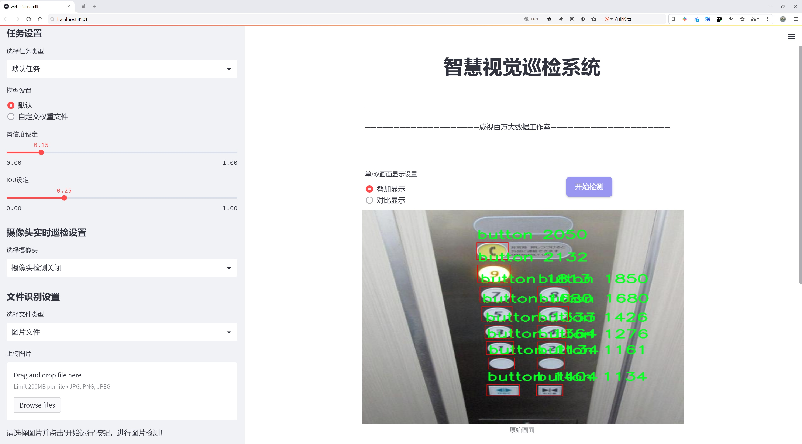
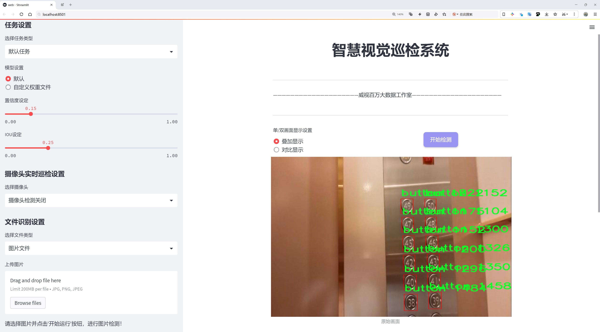
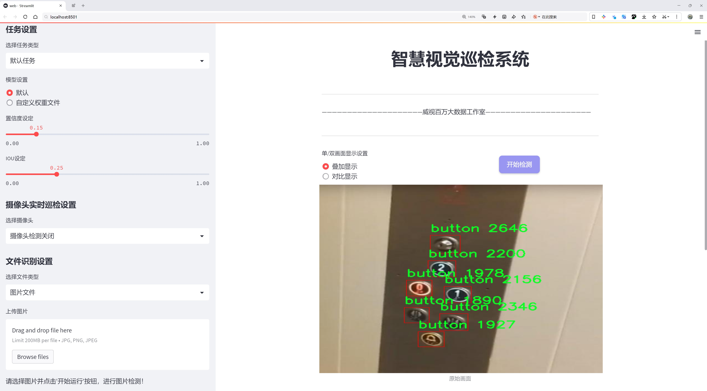

# 🎀 雌小鬼的电梯按钮检测系统

<div align="center">


**基于改进YOLOv8的电梯按钮智能检测系统**

*支持图片检测、视频检测、摄像头实时检测*

</div>

## ✨ 功能特色

- 🎯 **多模式检测**: 图片/视频/摄像头实时检测
- 🌐 **Web界面**: 友好的Streamlit网页界面
- 📸 **命令行工具**: 高效的命令行检测脚本
- 🤖 **完整训练**: 支持自定义数据集训练
- 📊 **性能监控**: 实时FPS和置信度显示
- 🔧 **参数调节**: 灵活的检测阈值配置

## 🚀 快速开始

### 1. 环境安装

```bash
# 克隆项目
git clone https://github.com/your-username/Elevator-button-detection.git
cd Elevator-button-detection

# 安装依赖
pip install -r requirements.txt
```

### 2. 立即体验

#### 🖥️ Web界面（推荐）
```bash
python3 ui.py
# 浏览器访问 http://localhost:8501
```

#### 📹 摄像头实时检测
```bash
# 基础使用
python3 camera_detect.py

# 使用训练好的模型
python3 camera_detect.py --model best.pt --conf 0.5
```

#### 📷 图片/视频检测
```bash
# 检测图片
python3 -c "from ultralytics import YOLO; YOLO('best.pt').predict('image.jpg')"

# 检测视频
python3 -c "from ultralytics import YOLO; YOLO('best.pt').predict('video.mp4')"
```

## 🎯 检测效果展示

<table>
<tr>
<td></td>
<td></td>
<td></td>
</tr>
<tr>
<td align="center">数字按钮检测</td>
<td align="center">功能按钮识别</td>
<td align="center">实时检测效果</td>
</tr>
</table>

## 🤖 训练自己的模型

### 数据准备
```bash
# 创建数据集结构
python3 train_elevator.py --create-dataset ./elevator_dataset

# 验证数据集
python3 train_elevator.py --validate ./elevator_dataset/elevator_data.yaml
```

### 开始训练
```bash
# 基础训练
python3 train_elevator.py --train ./elevator_dataset/elevator_data.yaml

# 高级训练
python3 train_elevator.py --train ./elevator_dataset/elevator_data.yaml \
    --model yolov8s --epochs 200 --batch 8
```

## 📋 支持的按钮类型

系统支持检测以下类型的电梯按钮：

| 类别 | 描述 | 示例 |
|------|------|------|
| 数字按钮 | 楼层数字 | 0-9, B1-B3 |
| 功能按钮 | 开关门等 | open, close, alarm |
| 方向按钮 | 上下指示 | up, down |
| 字母按钮 | 特殊楼层 | G, L, M, P |

完整类别列表请查看 `elevator_dataset/elevator_data.yaml`

## 🛠️ 使用方法详解

### Web界面功能

1. **图片检测模式**
   - 上传单张图片
   - 实时显示检测结果
   - 支持多种图片格式

2. **摄像头检测模式**
   - 启动/停止实时检测
   - 截图保存功能
   - 实时统计信息

3. **视频检测模式**
   - 批量处理视频文件
   - 结果自动保存

### 命令行工具

#### 摄像头检测
```bash
# 基本用法
python3 camera_detect.py

# 参数说明
python3 camera_detect.py \
    --model best.pt \           # 模型文件
    --conf 0.5 \               # 置信度阈值
    --camera 0 \               # 摄像头ID
    --no-fps                   # 不显示FPS
```

**控制键说明：**
- `q`: 退出检测
- `s`: 截图保存
- `c`: 切换置信度显示

#### 训练工具
```bash
# 创建数据集
python3 train_elevator.py --create-dataset /path/to/dataset

# 验证数据集
python3 train_elevator.py --validate /path/to/config.yaml

# 训练模型
python3 train_elevator.py --train /path/to/config.yaml --epochs 100
```

## 📁 项目结构

```
Elevator-button-detection/
├── camera_detect.py           # 摄像头检测脚本
├── web.py                     # Streamlit Web界面
├── ui.py                      # Web界面启动器
├── train_elevator.py          # 完整训练脚本
├── requirements.txt           # 依赖包列表
├── 快速使用指南.md            # 详细使用教程
├── 获取数据集指南.md          # 数据集制作指南
├── elevator_dataset/          # 数据集目录结构
│   ├── elevator_data.yaml     # 数据集配置
│   ├── train/                 # 训练集
│   ├── val/                   # 验证集
│   └── test/                  # 测试集
└── *.png                      # 示例图片
```

## ⚙️ 系统要求

- **Python**: 3.8+
- **操作系统**: Windows/macOS/Linux
- **内存**: 8GB+ (训练时推荐16GB+)
- **GPU**: 可选，但强烈推荐用于训练
- **摄像头**: 支持OpenCV的任何摄像头

## 🔧 配置选项

### 检测参数
- **置信度阈值**: 0.1-1.0（推荐0.4-0.6）
- **输入尺寸**: 320/640/1280像素
- **设备选择**: CPU/GPU自动选择

### 训练参数
- **模型大小**: yolov8n/s/m/l/x
- **训练轮数**: 建议100-300轮
- **批量大小**: 根据显存调整

## 🐛 常见问题

### 检测相关
**Q: 检测效果不好？**
A: 1. 降低置信度阈值 2. 使用训练好的专门模型 3. 改善光照条件

**Q: 摄像头无法打开？**
A: 1. 检查摄像头权限 2. 尝试不同的摄像头ID 3. 确保摄像头未被占用

### 训练相关
**Q: 训练速度慢？**
A: 1. 使用GPU训练 2. 减小批量大小 3. 使用较小的模型

**Q: 显存不足？**
A: 1. 减小batch_size 2. 降低输入分辨率 3. 使用较小模型

## 🤝 贡献指南

欢迎大家贡献代码！请遵循以下步骤：

1. Fork 本仓库
2. 创建功能分支 (`git checkout -b feature/AmazingFeature`)
3. 提交更改 (`git commit -m 'Add some AmazingFeature'`)
4. 推送到分支 (`git push origin feature/AmazingFeature`)
5. 开启 Pull Request

## 📄 许可证

本项目采用 MIT 许可证 - 详情请见 [LICENSE](LICENSE) 文件

## 🙏 致谢

- [Ultralytics YOLOv8](https://github.com/ultralytics/ultralytics) - 核心检测算法
- [OpenCV](https://opencv.org/) - 计算机视觉库
- [Streamlit](https://streamlit.io/) - Web界面框架

## 📞 联系方式

- 项目链接: [https://github.com/your-username/Elevator-button-detection](https://github.com/your-username/Elevator-button-detection)
- 问题反馈: [Issues](https://github.com/your-username/Elevator-button-detection/issues)

---

<div align="center">

**⭐ 如果这个项目对你有帮助，请给个Star支持一下！ ⭐**

</div>
